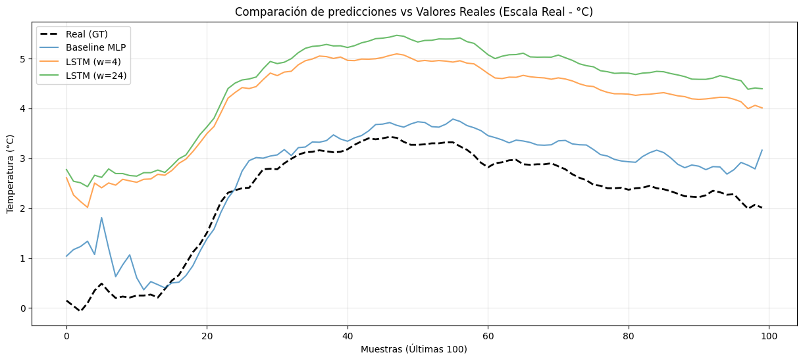

# Predicción de Series Temporales: Predicción del Clima usando Deep Learning

Este proyecto explora diferentes arquitecturas de deep learning para la predicción de series temporales usando datos históricos del clima. El objetivo principal es predecir valores futuros de temperatura analizando observaciones pasadas mediante un enfoque de **ventana deslizante**.

## 🚀 Resumen

El proyecto implementa y compara tres modelos diferentes para determinar la arquitectura más efectiva para la dinámica local de la temperatura:
1. **MLP Baseline**: Un perceptrón multicapa diseñado para una extracción rápida pero robusta de características espaciales a partir de ventanas.
2. **LSTM (w=4)**: Una red Long Short-Term Memory que captura dependencias temporales con un contexto corto.
3. **LSTM (w=24)**: Una LSTM avanzada con contexto temporal extendido para evaluar el impacto de un historial más largo en las predicciones.

## 📊 Principales Resultados

Un hallazgo importante de este análisis fue que el **modelo MLP Baseline superó a las arquitecturas LSTM** para este conjunto de datos específico. 

**Conclusión**: La complejidad del modelo no siempre garantiza mayor precisión. En casos con dinámica local fuerte, los modelos más simples pueden ser más eficientes y precisos que las redes recurrentes, enfatizando la importancia de probar modelos base en Data Science.

## 🛠️ Tecnologías Utilizadas

- **Framework**: PyTorch
- **Manejo de Datos**: Pandas, NumPy
- **Preprocesamiento**: Scikit-Learn (Estandarización)
- **Visualización**: Matplotlib (Resultados mostrados en escala real de Celsius)

## 📈 Resultados Visuales

El proyecto incluye una visualización comparativa de predicciones vs. valores reales. Todos los resultados se convierten de nuevo a unidades del mundo real (°C) para una interpretación intuitiva.

## 📂 Estructura del Proyecto

- [practica.ipynb]: Notebook principal con análisis de datos, entrenamiento de modelos y evaluación.
- [cleaned_weather.csv]: Dataset procesado usado para entrenamiento/pruebas.
- `requirements.txt`: Lista de dependencias necesarias para replicar el entorno.

